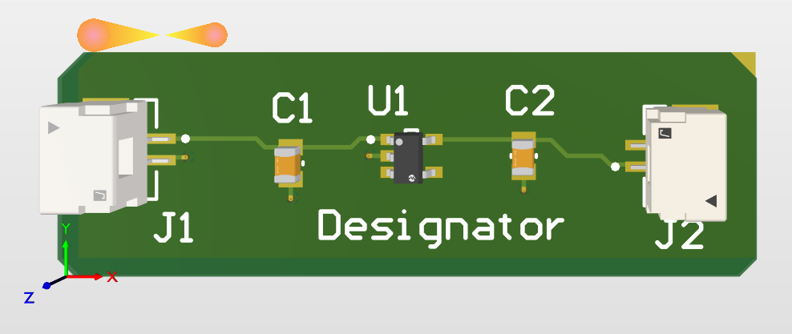

# PCB Designs
A collection of PCB designs created using Altium Designer.

---

## 01 — 5V to 3.3V LDO Voltage Regulator

### Overview
A compact LDO-based power regulation circuit that steps down a +5V input 
to a stable +3.3V output. Designed as a standalone power supply module 
suitable for integration into embedded systems and IoT devices.

### Schematic

### Key Specifications
- Input Voltage: +5V
- Output Voltage: +3.3V
- Regulator IC: MIC5317-3.3YM5-TR (150mA LDO)
- Decoupling Capacitors: 1µF on input and output
- Connectors: SM02B-GHS-TB(LF)(SN) JST GH series

### Design Decisions
- MIC5317 chosen for its low dropout voltage and small SOT-23-5 footprint
- 1µF ceramic caps on both VIN and VOUT for stability per datasheet recommendation
- JST GH connectors for compact, secure wire-to-board connection

### Tools Used
- **EDA Tool:** Altium Designer (Student Edition)
- **Design Files:** Schematic (.SchDoc), PCB Layout (.PcbDoc)

### Status
- [x] Schematic complete
- [x] PCB layout complete
- [ ] Fabricated & tested
